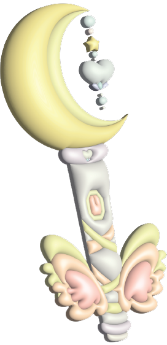

  

          

               <h1>Star Protector</h1>
          

          

               <h1>Magical Wands</h1>
          

          

               <h1>Powerpuff Girls</h1>
          
     
     

     

          

               
          

          

               Item 2
          

          

               Item 3
          
  
     

